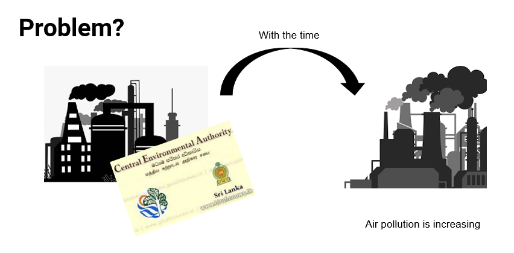
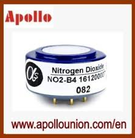

[comment]: # "This is the standard layout for the project, but you can clean this and use your own template"

# Embedded system for detecting adverse gases

---

## Team
-  E/15/243, NISANSALA R.M.B.S., [e15243@eng.pdn.ac.lk](mailto:e15243@eng.pdn.ac.lk)
-  E/15/271, PRASADIKA L.B.S., [sonaliprasadika077@gmail.com](mailto:sonaliprasadika077@gmail.com)
-  E/15/180, KARUNATHILAKA V.M.B.S.S.V., [supipivirajini@gmail.com](mailto:supipivirajini@gmail.com)

## Table of Contents
1. [Introduction](#introduction)
2. [Solution Architecture](#solution-architecture )
3. [Hardware & Software Designs](#hardware-and-software-designs)
4. [Testing](#testing)
5. [Links](#links)

---

## Introduction  

[Intro Video](docs/data/videos/Air_Quality_Monitor.mp4)  

As we all know, air pollution is a growing problem in Sri Lanka. This is mainly due to motorization and industrialization. Among those two sections, we concentrate on industrialization with a hope of providing solution to that problem from our decided embedded system.  

  

Basically, authorities who are responsible for air pollution controlling our country,tend to regulate air pollution due to toxic gasses leaving from factories only at the beginning of them. But,with the time, that process is not longer continued by the authorities.Then, the factories are feel free to discharge air pollutants to the environment by exceeding the limit identified by the authorities. This is because regularly, authorities do not have proper system to detect whether a factory is discharging air pollutants with a control.  

## Solution Architecture

Therefore, our plan is to implement an embedded system for the use of government, from which authorities can anytime come and check whether factories are discharging toxic gasses exceeding the limitation. Actually this is just like a meter reading at our home. On the display of the system, the percentage of CO, SO2, NO2, Humidity, Temperature will be shown.  

  

## Hardware and Software Designs
  

  

  

        

## Testing

The Test plan of our project, Air Quality monitor will be done through three types of tests. They are;

- Unit Test
- Integration Test
- Load Test  
 

[Modified Test Plan](docs/data/pdfs/Group_09_Air_Quality_Monitor_test_plan.pdf)  

## Links

- <a href = "https://github.com/cepdnaclk/e15-3yp-Embedded-system-for-detecting-adverse-gases" target = "_blank"> Project Repository </a>
- <a href = "https://cepdnaclk.github.io/e15-3yp-Embedded-system-for-detecting-adverse-gases/" target = "_blank">Project Page</a>
- <a href = "http://www.ce.pdn.ac.lk/" target = "_blank">Department of Computer Engineering</a>
- <a href = "https://eng.pdn.ac.lk/" target = "_blank">University of Peradeniya</a>

[//]: # (Please refer this to learn more about Markdown syntax)
[//]: # (https://github.com/adam-p/markdown-here/wiki/Markdown-Cheatsheet)
