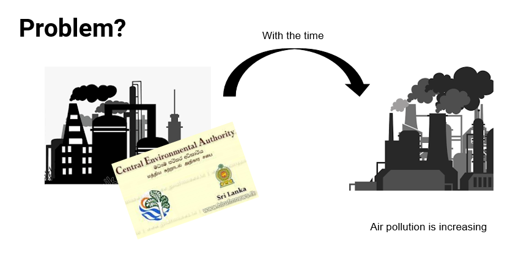
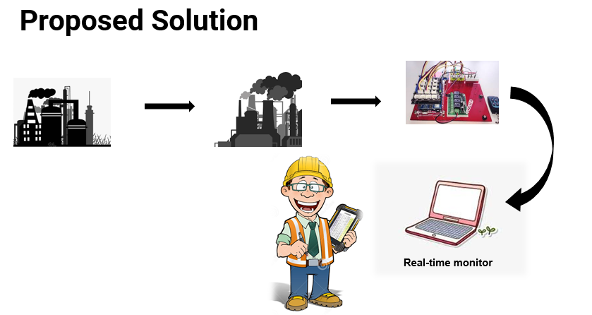
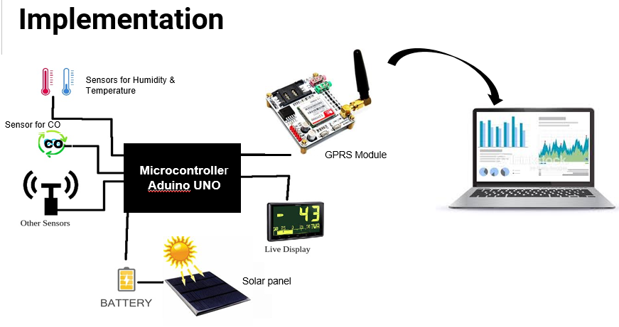
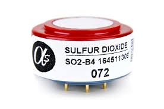

[comment]: # "This is the standard layout for the project, but you can clean this and use your own template"

# Embedded system for detecting adverse gases

---

## Team
-  E/15/243, NISANSALA R.M.B.S., [e15243@eng.pdn.ac.lk](mailto:e15243@eng.pdn.ac.lk)
-  E/15/271, PRASADIKA L.B.S., [sonaliprasadika077@gmail.com](mailto:sonaliprasadika077@gmail.com)
-  E/15/180, KARUNATHILAKA V.M.B.S.S.V., [supipivirajini@gmail.com](mailto:supipivirajini@gmail.com)

## Table of Contents
1. [Introduction](#introduction)
2. [Solution Architecture](#solution-architecture )
3. [Hardware & Software Designs](#hardware-and-software-designs)
4. [Testing](#testing)
5. [Links](#links)

---

## Introduction  

[Intro Video](data/videos/Air_Quality_Monitor.mp4)  

As we all know, air pollution is a growing problem in Sri Lanka. This is mainly due to motorization and industrialization. Among those two sections, we concentrate on industrialization with a hope of providing solution to that problem from our decided embedded system.  

  

Basically, authorities who are responsible for air pollution controlling our country,tend to regulate air pollution due to toxic gasses leaving from factories only at the beginning of them. But,with the time, that process is not longer continued by the authorities.Then, the factories are feel free to discharge air pollutants to the environment by exceeding the limit identified by the authorities. This is because regularly, authorities do not have proper system to detect whether a factory is discharging air pollutants with a control.  

## Solution Architecture

Therefore, our plan is to implement an embedded system for the use of government, from which authorities can anytime come and check whether factories are discharging toxic gasses exceeding the limitation. Actually this is just like a meter reading at our home. On the display of the system, the percentage of CO, SO2, NO2, Humidity, Temperature will be shown.  

  

## Hardware and Software Designs

In the server side we wish to analyze and filter the row of sensors and will display them on the web site graphically.  

  

For our project, we are going to use sensors; MQ9 (CO sensor), AM2301(Temperature and humidity sensor), SO2 alpha-sensors and NO2 sensor. Initially, sensor details were studied by referring datasheet of each sensor . After that, the sensors are connected to the arduino UNO board and arduino codes were written to all of those sensors in order to read voltage values of the sensors' outputs. Calibration is done for measuring temperature and humidity. Meanwhile, php and mysql were studied in order to create a database to website.  

        

As we decided at very first of that project, CO, SO2, Temperature and Humidity can be measured through the developed device. Furthermore, to measure CH4 gasses which are discharged from the factories, another sensor also was added. For that, MQ-2 Gas sensor module smoke was used. So at Milestone 3, successfully,  we could show that the device was taking data from that sensor.  

Up to now, data from sensors were retrieved using a WiFi-shield. But when WiFi is not available around corresponding factory, device will not work. Therefore, for the ability to use the device by any of the factories, we decided to add a GPRS. Up to now, performance of the project run under local server, but for the ability to work with GPRS, we need a public server. Then, after milestone 3, we expected to get a public server and do the coding for GPRS. From that, we hope to present our embedded system at next milestone with GPRS module. 

Furthermore, our Air Quality Monitor con be met with [Two nodes](data/pdfs/Budget_for_Two_Nodes.pdf)  

## Testing

The Test plan of our project, Air Quality monitor will be done through three types of tests. They are;

- Unit Test
- Integration Test
- Load Test  

### Unit Test

This testing type will be used in-order to verify the behavior of the Air Quality monitor independently from other parts. From that it can ensure that every single unit in the system works correctly.

Under Unit test, each sensor will be tested separately. How it is that output of each sensor will be compared with corresponding standard values or the values around our working environment. For an example, output from the temperature and humidity sensor will be compared with the values around our working area. Other values can be taken from Chemical department in our faculty. Inputs of sensors are in voltage, but after calibrating each sensor separately it will display output as temperature in Celsius, humidity as percentage and other gas sensors in ppm.

Workability of MQTT server will be tested using publisher and subscriber which are implemented within a same computer, even though they should be at two separated computers. When subscriber sends a string as a topic to publisher and publisher responds it by sending relevant data, then it can say that the MQTT is running properly. Considering our project, if subscriber sends a message as ‘SO2’ and then publisher responds to it showing SO2 quantity in ppm, then it can say that the MQTT is working well.

 

### Integration Test

Integration Test will be used in-order to demonstrate that different parts of a system work together in the real-life environment with the use of external resources. For our project, database and web servers will be used as external resources. By doing this testing. We hope to achieve a high level of confidence that the whole system works as expected.

If our project is considered, it can be tested whether the data taken from sensors is sent to Main server using MQTT, while publisher and subscriber are in two devices. If we can get results as same as in unit test for MQTT, then it can realize that data transferring from sensors to Main Server happens properly.

Furthermore, under this test, it can be checked whether data of every sensor is sent to database simultaneously by integrating each component of a node into a bread board. It can check whether the values shown at each unit test for every sensor can be seen in the LCD display. If it is, then it can finalize that all sensors are working correctly together. 

 

### Load Test

Under load test, it will be determined the speed, scalability of the system. From this test, the system behavior under both normal and peak load conditions (number of nodes) will be verified.

Final system will come up with the ability to response many nodes other than a single node. So, doing this test, we will get an idea about whether the embedded system will work for multiple nodes or not as well as how many factories the Air Quality Monitor can handle successfully and how it avoids the potential problems in future such as increased number of factories for the use of server.

This will be done by sending topics to publisher by subscriber. For each node that would be act as unique ones, when it handles different main topics for each node and the publisher gets separate response relevant to each node, then it can say the system can handle many of nodes. In here, past data will be deleted after those data are re-presented in graphs. Then it can save more space in database for the future use.  

[Modified Test Plan](data/pdfs/Group_09_Air_Quality_Monitor_test_plan.pdf)  

## Links

- <a href = "https://github.com/cepdnaclk/e15-3yp-Embedded-system-for-detecting-adverse-gases" target = "_blank"> Project Repository </a>
- <a href = "https://cepdnaclk.github.io/e15-3yp-Embedded-system-for-detecting-adverse-gases/" target = "_blank">Project Page</a>
- <a href = "http://www.ce.pdn.ac.lk/" target = "_blank">Department of Computer Engineering</a>
- <a href = "https://eng.pdn.ac.lk/" target = "_blank">University of Peradeniya</a>

[//]: # (Please refer this to learn more about Markdown syntax)
[//]: # (https://github.com/adam-p/markdown-here/wiki/Markdown-Cheatsheet)
